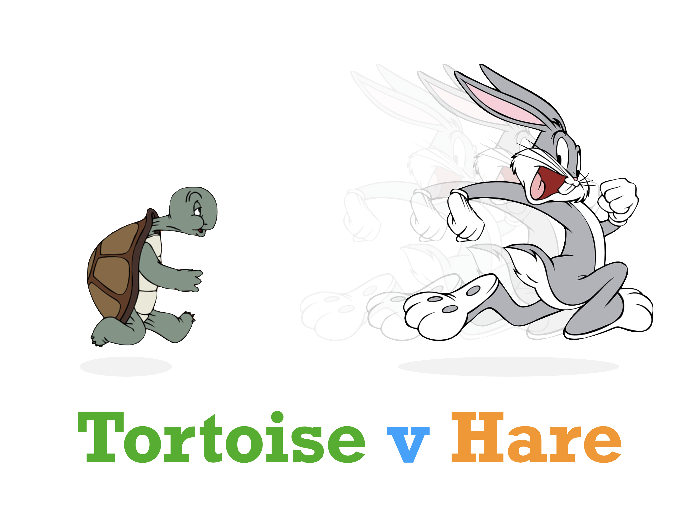
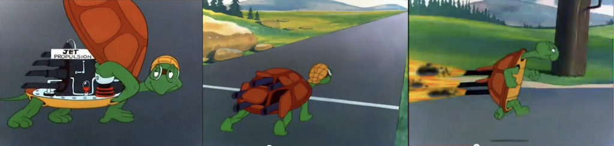
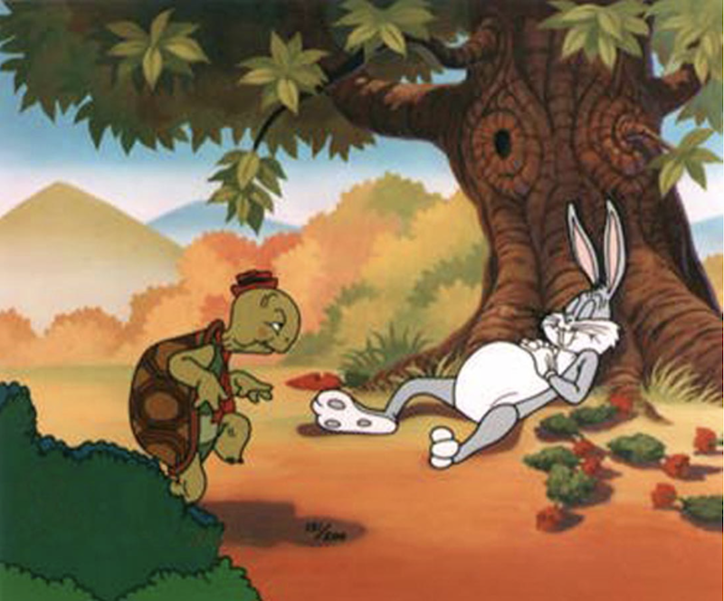

# tortoise-vs-hare

Tortoise v Hare, a Monte-Carlo Board Game Design

## Idea

I was interested in the idea of creating a board game with a fundamental imbalance and wondered whether I could use a Monte Carlo simulation to tweak it until it was balanced. I chose the idea of the Tortoise vs the Hare, a simple "Game of the Goose" race game concept where players race a counter on a path of squares, and the initial assumption that the tortoise would only roll one die while the hare would roll two.

## Tweaks

My first thought was that the Hare would have to take naps. If he napped every time he rolled a double and then woke up again every time he rolled another, would that be enough to balance the game? My second thought was, could the tortoise have a jet-pack, like he does in the Bugs Bunny cartoons? How would that work?

I simulated the basic game mechanics with a simple javascript program and ran it 1,000,000 times counting the number of times the hare won, the number of times the tortoise won, and the number of draws where both animals arrived on the finish line on the same turn (e.g. the tenth roll of both players).

Then I added naps for the hare, then a jetpack for the tortoise. Then I had to make the jet-pack very unreliable.

Various interesting game mechanics fell out of this after each run. Lots of ideas had to be abandoned. Each time I would balance the mechanism and then introduce another idea and repeat the balance process.

I soon had the following balanced rules:

### Tortoise

-   Rolls one die
-   Starts flying if they roll a 6
-   When flying, their die roll is doubled
-   Breaks down again if they roll a 1

### Hare

-   Rolls two dice
-   Falls asleep if the player rolls a double
-   Doesn't move until they wake again
-   Wakes from sleep if they roll an even number on a single die

## The board

Finally I simulated a board with various special squares: miss a turn, roll again, etc. I placed the squares in random places and ran the tests millions of times. I discovered that just as important as the special squares and their placement was the overall length o the board. Adding or removing a square could make a crucial difference.

In the end I ended up with the following special squares:

-   Miss a turn (MT)
-   Roll again (RA)
-   Forward 3 squares (F3)
-   Back 3 squares (B3)
-   Tortoise crashes if flying (CR)
-   Hare falls asleep, presumably due to a field of carrots (zz)

And a board with 79 squares (I was looking for a game with around 10 rolls for each player):

## Results

| Scenario      |       n |   % |
| :------------ | ------: | --: |
| hare wins     | 461,535 | 46% |
| tortoise wins | 459,314 | 45% |
| draws         |  79,151 |  7% |

    spaces: 79 fly-speed: 2
    sims: 1000000
    t: 459314 h: 461535 d: 79151
    hare wins: 46%
    tortoise wins: 45%
    draws: 7%
    ave turns: 12.54
    ave sleeps: 1.64
    ave flights: 1.48

    79150
    6275215
    { d: 6275215, t: 42685259, h: 42740956 }
    [
      'ra',    'empty', 'empty', 'empty', 'empty', 'f3',
      'empty', 'empty', 'empty', 'empty', 'empty', 'empty',
      'empty', 'empty', 'b3',    'empty', 'empty', 'empty',
      'empty', 'empty', 'empty', 'f3',    'zz',    'empty',
      'ra',    'empty', 'b3',    'empty', 'empty', 'empty',
      'f3',    'cr',    'empty', 'empty', 'empty', 'empty',
      'empty', 'mt',    'empty', 'empty', 'empty', 'empty',
      'empty', 'empty', 'empty', 'empty', 'empty', 'empty',
      'empty', 'empty', 'empty', 'empty', 'mt',    'empty',
      'ra',    'empty', 'empty', 'empty', 'cr',    'b3',
      'f3',    'b3',    'b3',    'empty', 'empty', 'f3',
      'empty', 'empty', 'empty', 'zz',    'empty', 'empty',
      'zz',    'empty', 'empty', 'mt',    'empty', 'empty',
      'empty'
    ]
